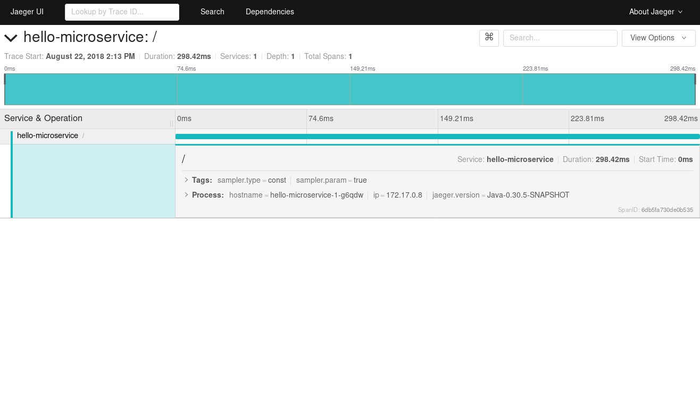

= Red Hat OpenShift Application Runtime - Jaeger Agent as sidecar
:toc: macro

This example is based on the link:https://github.com/rhoar-enablement/vert.x[Red Hat OpenShift Application Runtime Vert.x example]
and adds distributed tracing support via link:https://jaegertracing.io[Jaeger] by:

* Adding a tracer initialization routine in the verticle constructor
* Wraps the HTTP requests in a span

toc::[]

== Running

=== Bare metal

Start Jaeger
[source,bash]
----
docker run \
    --rm \
    --name jaeger \
    -p6831:6831/udp \
    -p16686:16686 \
    jaegertracing/all-in-one:1.6
----

Run the application with sampling set to 1, to record all incoming requests:
[source,bash]
----
JAEGER_SAMPLER_TYPE=const JAEGER_SAMPLER_PARAM=1 mvn clean vertx:run
----

And call the HTTP endpoint:
[source,bash]
----
curl localhost:8080
----

A trace with a single span should now be available at link:http://localhost:16686[Jaeger] and should look
like this:

=== OpenShift

Start OpenShift. For instance, via link:https://github.com/minishift/minishift[Minishift]:
[source,bash]
----
minishift start
----

Install a backing storage for your Jaeger instance. As a starting point, the
link:https://github.com/jaegertracing/jaeger-openshift[jaeger-openshift] project provides
templates such as for Elasticsearch:

[source,bash]
----
oc create -f https://raw.githubusercontent.com/jaegertracing/jaeger-openshift/master/production/elasticsearch.yml
----

Then, install a ConfigMap that will be used by Jaeger, with details about the backing storage:

[source,bash]
----
oc create -f https://raw.githubusercontent.com/jaegertracing/jaeger-openshift/master/production/configmap-elasticsearch.yml
----

If you want to customize your Jaeger Collector or Jaeger Query, you can use the `oc edit` command, such as:

[source,bash]
----
oc edit configmap jaeger-configuration
----

Then, install the Jaeger components:
[source,bash]
----
oc process -f https://raw.githubusercontent.com/jaegertracing/jaeger-openshift/master/production/jaeger-production-template.yml | oc create -f -
----

With all the required components installed, we can deploy our application:
[source,bash]
----
mvn clean fabric8:deploy -Popenshift
----

Once it's deployed, get the URL for our service, which should be something like `hello-microservice-myproject.1.2.3.4.nip.io`
[source,bash]
----
oc get route hello-microservice
----

And run a `curl` call to it:
[source,bash]
----
curl hello-microservice-myproject.1.2.3.4.nip.io
----

We should now see a trace on Jaeger's UI. To see where it's located:
[source,bash]
----
oc get route jaeger-query
----

It should be something like: `jaeger-query-myproject.192.168.42.223.nip.io`. Open this address in your web browser
and you should see a trace similar to the one below.

